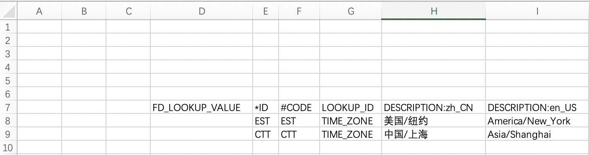
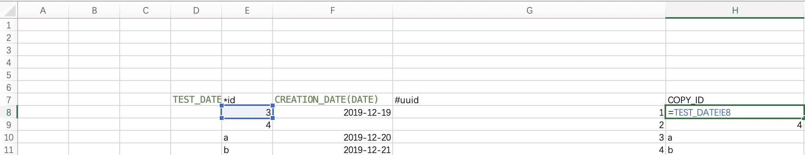

# choerodon-tool-liquibase

初始化数据库工具，使用指定文件夹的groovy文件创建数据库表，使用execl文件(只能是`.xlsx`格式文件)初始化数据。

## 初始化数据库脚本

```shell
#!/usr/bin/env bash
mkdir -p target
if [ ! -f target/choerodon-tool-liquibase.jar ]
then
    curl http://nexus.choerodon.com.cn/repository/choerodon-release/io/choerodon/choerodon-tool-liquibase/0.10.0.RELEASE/choerodon-tool-liquibase-0.10.0.RELEASE.jar -L  -o target/choerodon-tool-liquibase.jar
fi
java -Dspring.datasource.url="jdbc:mysql://localhost:3306/iam_service?useUnicode=true&characterEncoding=utf-8&useSSL=false" \
 -Dspring.datasource.username=root \
 -Dspring.datasource.password=root \
 -Ddata.drop=false -Ddata.init=true \
 -Ddata.dir=src/main/resources \
 -jar target/choerodon-tool-liquibase.jar

```

- `-Dspring.datasource.url`： 数据源url
- `-Dspring.datasource.username`：数据库登陆用户
- `-Ddata.drop=false`：是否清除数据库数据
- `-Ddata.init`：是否使用excel数据进行数据初始化
- `-Ddata.dir`：groovy和excel所在的文件夹，扫描指定文件夹下的所有`.groovy`和`.xlsx`文件

## groovy建表

groovy使用的是liquibase语法，语法参考[官网文档](https://www.liquibase.org/documentation/changes/add_column.html)

下面是一个demo及相关解释：

```groovy
package script.db

databaseChangeLog(logicalFilePath: 'script/db/iam_label.groovy') {
    changeSet(author: 'jcalaz@163.com', id: '2018-04-13-iam-label') {
        if (helper.dbType().isSupportSequence()) {
            createSequence(sequenceName: 'IAM_LABEL_S', startValue: "1")
        }
        createTable(tableName: "IAM_LABEL") {
            column(name: 'ID', type: 'BIGINT UNSIGNED', autoIncrement: true, remarks: '表ID，主键，供其他表做外键，unsigned bigint、单表时自增、步长为 1') {
                constraints(primaryKey: true, primaryKeyName: 'PK_IAM_LABEL')
            }
            column(name: 'NAME', type: 'VARCHAR(64)', remarks: '名称') {
                constraints(nullable: false)
            }
            column(name: 'TYPE', type: 'VARCHAR(32)', remarks: '类型') {
                constraints(nullable: false)
            }
            column(name: "OBJECT_VERSION_NUMBER", type: "BIGINT UNSIGNED", defaultValue: "1") {
                constraints(nullable: true)
            }
            column(name: "CREATED_BY", type: "BIGINT UNSIGNED", defaultValue: "0") {
                constraints(nullable: true)
            }
            column(name: "CREATION_DATE", type: "DATETIME", defaultValueComputed: "CURRENT_TIMESTAMP")
            column(name: "LAST_UPDATED_BY", type: "BIGINT UNSIGNED", defaultValue: "0") {
                constraints(nullable: true)
            }
            column(name: "LAST_UPDATE_DATE", type: "DATETIME", defaultValueComputed: "CURRENT_TIMESTAMP")
        }
        addUniqueConstraint(tableName: 'IAM_LABEL', columnNames: 'NAME, TYPE', constraintName: 'UK_IAM_LABEL_U1')
    }

    changeSet(author: 'superleader8@gmail.com', id: '2018-07-23-iam-label-add-column') {
        addColumn(tableName: 'IAM_LABEL') {
            column(name: 'LEVEL', type: "VARCHAR(32)", remarks: '层级', afterColumn: 'TYPE') {
                constraints(nullable: false)
            }
            column(name: 'DESCRIPTION', type: "VARCHAR(128)", remarks: '描述', afterColumn: 'LEVEL')
        }
    }

    changeSet(author: 'superleader8@gmail.com', id: '2018-08-22-rename') {
        renameColumn(columnDataType: 'VARCHAR(32)', newColumnName: "FD_LEVEL", oldColumnName: "LEVEL", remarks: '层级', tableName: 'IAM_LABEL')
    }
}
```

- `package`：groovy所在的包名
- `logicalFilePath`：相对于`-Ddata.dir`的相对路径
- `changeSet.id`：每一个changeSet的唯一标识，全局唯一
- `helper.dbType().isSupportSequence()`：如果数据库支持序列，则给每张表建立对应的序列。*强制*序列规范为表名+`_s`结尾，序列名不超过30位。
- `索引规范`：*非强制*choerodon的索引都加有索引名，方便后期维护。mysql的索引是表内唯一，但oracle的索引是数据库唯一，建议索引名使用全局唯一，主键索引是`PK_`+表名，唯一索引是`UK_`+表名。多个主键索引或唯一索引情况下，表名后加数字1，2，3...区分。索引名不能超过30位。
-  `changeSet`：每次表的修改都要新建一个changeSet，直接修改已经执行过的changeSet不会生效
- 表名建议不超过30位，oracle数据库的对象名有30位长度约束

# excel初始化数据及相关用法

* 一张表一个sheet页，sheet页名为表名
* 同一张表的数据要行连续，否则空行以下的数据无法被初始化
* 有效数据从D7开始，A-C列，1-6行的数据会被忽略，如下：



* excel起始数据第一行第一列写表名
* excel第一行数据写列名
* `*`：一般标识主键列，表示自动生成，excel值如果可以转换为long类型，则将该值插入，如果不能转为long，对于支持主键自增策略的数据库(mysql,sqlserver等)，则主键递增；对于支持序列的数据库(oracle等)，从序列中拿值。
* `#`: 必填项，没有该标记的表会报错。初始化数据时，根据#列查询判断数据是否存在，如果存在的则执行更新操作，如果不存在则执行插入操作。可支持多列，但是#列的值只能是数字或字符串，如果是公式引用的话，会先确定公式的值。
* 只支持`DATE` `DECIMAL` `NUMERIC` `BIGINT` `VARCHAR`五种jdbc type，默认为varchar，示例如下：
* 注意本地做初始化数据库时，需要把excel保存后关闭，否则抛异常，初始化失败



对于日期类型，使用括号在列旁标识类型，日期类型格式为标准iso date formatter，即`yyyy-mm-dd`或`yyyy-mm-ddThh:mm:ss.ffffff`。其他的三种类型用法和日期一样，用括号标明类型即可。

* 引用： 如上图H8`=TEST_DATE!E8`即为引用，一般用于插入数据，自动生成id的方式引用id，`=TEST_DATE`为sheet页名
* 多语言： 多语言表的多语言字段，使用`:`分割，左侧为列名，右侧为语言代码，即可初始化多语言表（tableName+_tl）

# starter版本和dbtools版本映射

| starter version | dbtools version|
|:-----:|:-----:|
|0.9.0|0.6.1|
|0.9.2|0.6.2|
